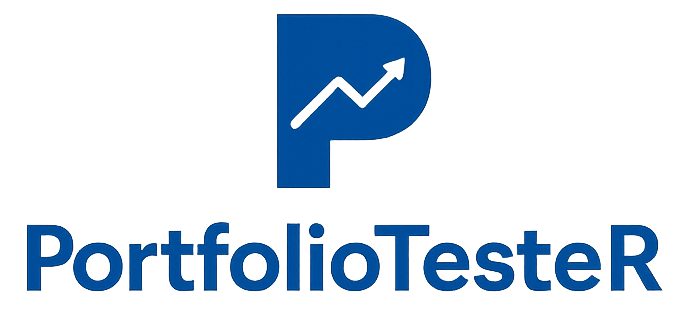

<p align="center">
  
</p>
<h1 align="center">PortfolioTesteR</h1>


## Test Investment Strategies with English-Like Code

PortfolioTesteR is an R package designed for students and individual investors to test investment strategies using clear, readable code. Unlike complex quantitative libraries, PortfolioTesteR uses intuitive function names that read like plain English, making strategy development accessible to everyone.

## Why PortfolioTesteR?

- **English-like syntax**: Functions like `filter_top_n()`, `weight_equally()`, and `run_backtest()` are self-explanatory
- **Educational focus**: Perfect for learning quantitative investing without getting lost in code complexity  
- **Comprehensive toolkit**: 70+ functions covering everything from technical indicators to risk analysis
- **Fast backtesting**: Optimized for testing strategies on large stock universes
- **Ready-to-use data**: Includes sample price data to start testing immediately
- **Realistic results**: Handles warmup periods, transaction tracking, and proper return calculations

## Installation

Install from GitHub:

```r
# install.packages("devtools")
devtools::install_github("AlbertoPallotta/PortfolioTesteR")
```

## Quick Start Example

```r
library(PortfolioTesteR)

# Load sample data
data(sample_prices_weekly)

# Calculate 12-week momentum
momentum <- calc_momentum(sample_prices_weekly, lookback = 12)

# Select top 10 momentum stocks
top_momentum <- filter_top_n(momentum, n = 10)

# Weight selected stocks equally
weights <- weight_equally(top_momentum)

# Run backtest
result <- run_backtest(
  prices = sample_prices_weekly,
  weights = weights,
  initial_capital = 100000,
  name = "Simple Momentum"
)

# View results
print(result)
summary(result)
plot(result)
```

## Main Functions

### Data Loading
- `sql_adapter()` - Load from SQLite databases
- `csv_adapter()` - Load from CSV files
- `load_mixed_symbols()` - Combine different data sources

### Technical Indicators
- `calc_momentum()` - Price momentum
- `calc_rsi()` - Relative Strength Index
- `calc_moving_average()` - Simple moving averages
- `calc_stochastic_d()` - Stochastic oscillator
- `calc_rolling_volatility()` - Rolling historical volatility (std / range / MAD / abs-return)
- `calc_distance()` - Distance between price series

### Stock Selection
- `filter_top_n()` - Select top/bottom N stocks
- `filter_above()` - Select above threshold
- `filter_below()` - Select below threshold
- `filter_between()` - Select within range
- `combine_filters()` - Combine multiple conditions
- `apply_regime()` - Filter based on market conditions

### Portfolio Weighting
- `weight_equally()` - Equal weight (1/N)
- `weight_by_signal()` - Weight by signal strength
- `weight_by_rank()` - Weight by ranking
- `weight_by_volatility()` - Inverse volatility weighting
- `weight_by_hrp()` - Hierarchical Risk Parity

### Backtesting & Analysis
- `run_backtest()` - Execute strategy backtest
- `analyze_performance()` - Detailed performance metrics
- `print()` - Display backtest results
- `summary()` - Show detailed statistics
- `plot()` - Visualize performance

## Sample Data Included

The package includes three datasets for immediate testing:
- `sample_prices_weekly` - Weekly prices for 20 stocks (2017-2020)
- `sample_prices_daily` - Daily prices for detailed analysis
- `sample_sp500_sectors` - Sector classifications

Load them with:
```r
data(sample_prices_weekly)
data(sample_prices_daily)
data(sample_sp500_sectors)
```

## Documentation

Every function includes detailed documentation with examples:

```r
?run_backtest
?calc_momentum
?filter_top_n
```

## Disclaimer

This package is for educational and research purposes only. Past performance does not guarantee future results. Always conduct your own research before making investment decisions. The author is not responsible for any financial losses incurred from using this software.

## Author

Alberto Pallotta

## License

MIT License

## Contributing

We welcome contributions! Please feel free to submit issues and pull requests on [GitHub](https://github.com/AlbertoPallotta/PortfolioTesteR).
